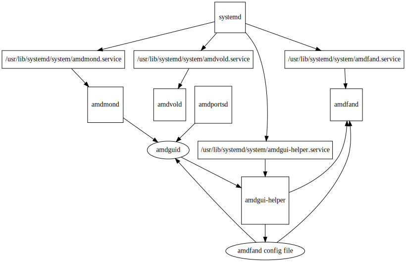

[](https://discord.gg/HXN2QXj3Gv)
[](https://discord.gg/HXN2QXj3Gv)

[ This project is created with love. Please, support me](https://www.buymeacoffee.com/eraden)

# AMD GPU management tools

This repository holds couple tools for AMD graphic cards

* `amdfand` - fan speed daemon (MUSL)
* `amdvold` - voltage and overclocking tool (MUSL)
* `amdmond` - monitor daemon (MUSL)
* `amdguid` - GUI manager (GLIBC)
* `amdgui-helper` - daemon with elevated privileges to scan for `amdfand` daemons, reload them and save config files (MUSL)

For more information please check README each of them.

## Roadmap

* [X] Add support for multiple cards
    * Multiple services must recognize card even if there's multiple same version cards is installed
    * Support should be by using `--config` option
* [ ] CLI for fan config edit
* [ ] CLI for voltage edit
* [X] GUI application using native Rust framework (ex. egui, druid)

## License

This work is dual-licensed under Apache 2.0 and MIT. You can choose between one of them if you use this work.

## Supported OS

Only Linux is supported.

BSD OS may work if compiled from source, but it wasn't tested.
I also don't know how to enable all amd gpu features on BSD.

### Officially supported

* Arch Linux
* Ubuntu 18.04
* Ubuntu 20.04

### Other

It should be possible to run MUSL programs on any Linux distribution.

GLIBC applications depends on shared glibc libraries and version of this library MUST match.

If you have other version you may download linked version and place it in application directory.

Or you can compile it from source

#### Compile

```bash
./scripts/build.sh local
```

#### Download missing shared libraries

##### Check linked versions

```bash
ldd ./amdguid
```

Example output:

```
	linux-vdso.so.1 (0x00007ffd706df000)
	libxcb.so.1 => /usr/lib/libxcb.so.1 (0x00007f4254a50000)
	libxcb-render.so.0 => /usr/lib/libxcb-render.so.0 (0x00007f4254a40000)
	libxcb-shape.so.0 => /usr/lib/libxcb-shape.so.0 (0x00007f4254a3b000)
	libxcb-xfixes.so.0 => /usr/lib/libxcb-xfixes.so.0 (0x00007f4254a31000)
	libdl.so.2 => /usr/lib/libdl.so.2 (0x00007f4254a2c000)
	libgcc_s.so.1 => /usr/lib/libgcc_s.so.1 (0x00007f4254a11000)
	librt.so.1 => /usr/lib/librt.so.1 (0x00007f4254a0a000)
	libpthread.so.0 => /usr/lib/libpthread.so.0 (0x00007f4254a05000)
	libm.so.6 => /usr/lib/libm.so.6 (0x00007f425491d000)
	libc.so.6 => /usr/lib/libc.so.6 (0x00007f4254713000)
	/lib64/ld-linux-x86-64.so.2 => /usr/lib64/ld-linux-x86-64.so.2 (0x00007f42556a6000)
	libXau.so.6 => /usr/lib/libXau.so.6 (0x00007f425470e000)
	libXdmcp.so.6 => /usr/lib/libXdmcp.so.6 (0x00007f4254706000)
```

If anything is missing you may download is and place it side-by-side with binary 

##### Example:

```
opt/
├─ amdguid/
│  ├─ amdguid
│  ├─ shared_lib_a/
│  ├─ shared_lib_b/
usr/
├─ bin/
│  ├─ amdguid
```

Where:

* `/opt/amdguid/amdguid` is binary file
* `/usr/bin/amdguid` is shell script with following content

```bash
#!/usr/bin/env bash

cd /opt/amdguid
./amdguid
```

### Architecture



#### SystemD files

Depends on what you actually need select which application you are using you need to copy service file to systemd directory.

* For `amdfand` you need `amdfand.service`
* For `amdmond` you need `amdmond.service`
* For `amdguid` which will use `amdfand` you need `amdfand.service` and `amdgui-helper.service`  
* For `amdguid` which will use `amdmond` you need `amdmond.service`  

You need `amdgui-helper.service` because GUI client does not have `root` privileges, so it can't write new config file, and it can't check if process is still alive.

```
# cp ./services/amdmond.service /usr/lib/systemd/system/amdmond.service
# cp ./services/amdvold.service /usr/lib/systemd/system/amdvold.service
# cp ./services/amdgui-helper.service /usr/lib/systemd/system/amdgui-helper.service
# cp ./services/amdfand.service /usr/lib/systemd/system/amdfand.service
```

After you copied service files you need to activate services

```
# systemctl enable --now amdmond
# systemctl enable --now amdfand
# systemctl enable --now amdgui-helper
```